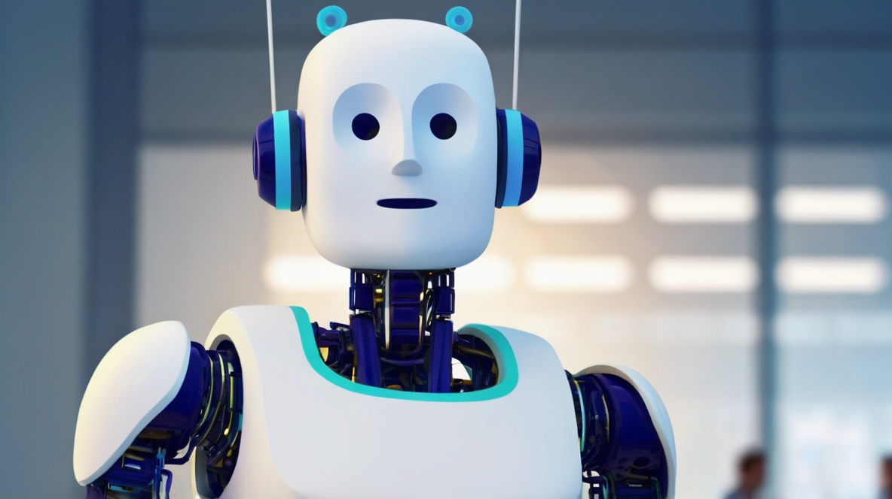
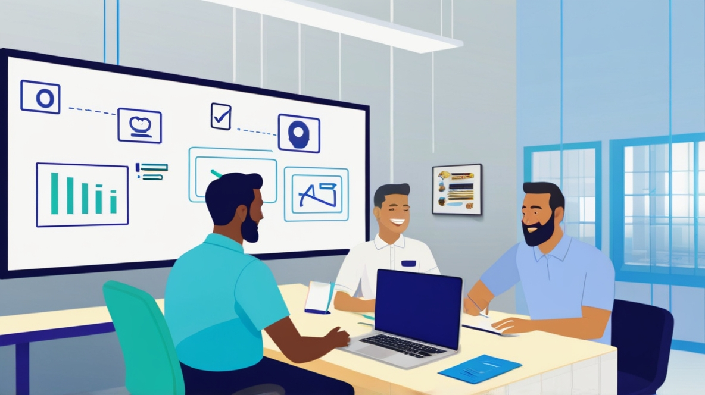

# Unleash Your Inner AI Innovator: Build a Next-Gen Customer Agent with Google Cloud

This hackathon invites you to create a cutting-edge customer service agent powered by Google Cloud Vertex AI Agent Builder. This no-code solution allows you to rapidly prototype your generative AI agent, transforming the way you interact with your customers.

# Work Solo or Assemble Your Dream Team:

Whether you're a lone wolf or prefer to collaborate, this hackathon welcomes both individual and team participation. Here are some key roles to consider for your team:

- Business Visionary: Identify how your AI agent will drive revenue and improve customer experience.
- Project Maestro: Orchestrate the project's success by managing tasks, fostering clear communication, and resolving any roadblocks that may arise.
- AI Architect: Design the AI agent solution, leveraging the diverse tools within Agent Builder to craft a robust and innovative architecture.
- Prompt Master: Craft exceptional prompts to guide the agent's responses and ensure a natural, engaging conversation flow for your customers.
- QA Champion: Rigorously test the agent to guarantee a flawless user experience before deployment.

# Beyond Efficiency: Building a Financially Impactful Solution

Your goal extends beyond building a technically proficient agent. We challenge you to create an advanced agent that leverages documents to answer your customers' questions while simultaneously considering the following:
- Economic Impact: Demonstrate how your AI agent will generate revenue or optimize costs for your business.
- Customer Experience Improvement: Highlight how your agent will enhance customer satisfaction and loyalty.

# Whiteboard Your Vision, Conquer the Challenge

The hackathon unfolds in two phases:
- Phase 1: Whiteboard Session
    - Business Brainstorming: Outline your business strategy, considering revenue opportunities and customer experience improvements the agent can deliver.
    - Project Management & Architecture Design: The project manager will define the project timeline, while the AI Architect crafts the technical solution leveraging Agent Builder's tools.

- Phase 2: Implementation & Testing
  - Collaborative Development: The AI Architect, Prompt Master, and the QA Champion work together under the project manager's supervision to build the solution.

# The Grand Finale: Unveiling the Champion Agent

The hackathon culminates with the evaluation of the best agent solution. We will assess your project across all aspects, including:
- Business Impact: Potential for revenue generation or cost optimization.
- Project Management: Efficiency and effectiveness in project execution.
- Agent Sophistication: Technical proficiency and ability to address customer queries effectively.
- Security Adherence: Implementation of robust security measures to mitigate Agent Hallucinations.